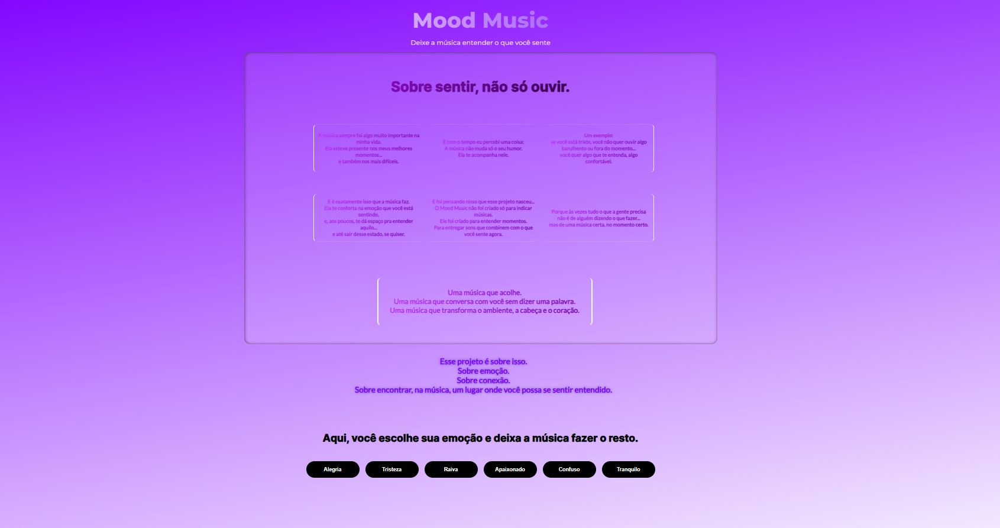

# 🎧 Mood Music

> Um projeto criado para conectar emoções com música.

🔗 **Acesse o projeto:**  
https://mood-music-chi.vercel.app

---

## 📌 Sobre o projeto

O **Mood Music** nasceu de algo pessoal.

A música sempre esteve presente nos meus melhores momentos…  
e também nos mais difíceis.

Com o tempo, percebi algo importante:

> A música não muda apenas o seu humor.  
> Ela te acompanha nele.

Quando estamos tristes, não queremos algo agitado.  
Queremos algo que entenda o momento.

E é exatamente isso que o Mood Music faz.

Ele não tenta mudar o que você sente —  
ele **te acompanha na sua emoção**.

---

## 🧠 Arquitetura do projeto

O projeto foi desenvolvido com arquitetura **full stack**, separando responsabilidades:

- 🌐 **Frontend:** React (Vercel)
- ⚙️ **Backend:** Node.js + Express (Render)
- 🗄️ **Banco de Dados:** MySQL (Railway)

---

## 🎯 Objetivo

Criar uma experiência onde o usuário possa:

- Escolher uma emoção  
- Receber músicas compatíveis com esse sentimento  
- Se sentir compreendido através da música  

---

## 🚀 Funcionalidades

### 🎧 Experiência Musical
- 🎵 Seleção de músicas por emoção:
  - Tristeza  
  - Alegria  
  - Raiva  
  - Apaixonado  
  - Confuso  
  - Tranquilo  

- 🔀 Entrega de músicas de forma aleatória  
  (evitando repetição e mantendo a experiência dinâmica)

- 💬 Frases personalizadas para cada música  
  (criando conexão emocional com o usuário)

---

### ▶️ Player de Música (YouTube API)

- ▶️ Play / Pause personalizados  
- ⏭️ Avançar para próxima música  
- ⏮️ Voltar para música anterior
- 🔄 Reprodução automática ao final da música
- 🎚️ Barra de progresso sincronizada com o tempo real
- ⏱️ Exibição do tempo atual e duração

---

### ⚡ Experiência do Usuário (UX)

- ⏳ Estado de carregamento (UX aprimorada)

---

## 🧠 Diferencial do projeto

O Mood Music não é apenas um player de música.

Ele foi pensado como uma **experiência emocional**.

Diferente de playlists comuns:
- Não é baseado em algoritmo frio  
- Não tenta forçar mudança de humor  
- Respeita o momento do usuário  

---

## 🛠️ Tecnologias utilizadas

### Frontend
- React  
- Vite  
- CSS  

### Backend
- Node.js  
- Express  

### Banco de Dados
- MySQL  

### Infraestrutura
- Vercel (Frontend)  
- Render (Backend)  
- Railway (Database)  

### Outros
- YouTube (via IDs)

---

## 🗄️ Estrutura dos dados

Cada música possui:

- Nome  
- Artista  
- Emoção  
- Intensidade  
- YouTube ID  
- Frase personalizada  
- Duração em segundos  

---

## 📸 Demonstração

---

---

## 🔮 Melhorias futuras

- 🤖 Sugestão de emoção com IA  
- 📊 Análise de dados das emoções mais selecionadas  
- 👤 Sistema de usuário e histórico  
- 🎯 Recomendação personalizada  
- 🎶 Integração com Spotify API  

---

## 💡 Aprendizados

Durante o desenvolvimento deste projeto, trabalhei com:

- Estruturação de dados para recomendação  
- Integração completa entre frontend, backend e banco de dados  
- Deploy de aplicações full stack  
- Consumo de API no frontend  
- Gerenciamento de estados no React  
- Experiência do usuário (UX)  

---

## ⭐ Considerações finais

Este projeto é mais do que código.

Ele representa algo pessoal.  
Uma forma de transformar sentimentos em algo compreensível.

E também marca minha evolução como desenvolvedor,  
construindo uma aplicação completa do início ao deploy em produção.